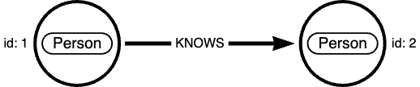
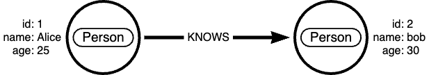
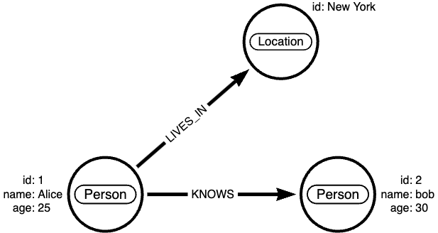

# Nodestream Progession Demo (NODES 2024)

This is a simple demo to show how to use the Nodestream API to progressively evolve a database.

As you change and evolve your database, you can use simply compose new nodestream pipelines to expand and replace your database. 

## Setup

You'll neeed to have a working nodestream install and a database to run against. 

### Nodestream

```
pipx install nodestream
pipx inject nodestream nodestream-plugin-neo4j
```

### Database

Easiest way to get a database to play with is to use docker. 

```
docker run \
    --restart always \
    --publish=7475:7474 --publish=7687:7687 \
    --env NEO4J_AUTH=neo4j/neo4j123 \
    --env NEO4J_PLUGINS='["apoc"]' \
    neo4j:5.21
```

## Phases

### Phase 1 - Initial Database

In phase one, all we are going to do is create a simple database with a `Person` to `Person` relationship. 
The raw data is stored in a CSV file like this:

```
person_id_a,person_id_b
1,2
2,3
...
``` 

- [Pipeline](./pipelines/social.yaml)

Below is a diagram of the schema:



#### Instructions

1. Uncomment the pipeline in `nodestream.yaml`
1. Run `nodestream migrations make` to create the initial migration
1. Run `nodestream migrations run --target my-db` to apply the migration to your database
1. Run `nodestream run social --target my-db` to populate the database with the raw data
1. Oberserve the change in the database schema

### Phase 2 - Add new `Person` attributes

In phase two, we are going to add new attributes to the `Person` entity.
The raw data is stored in a CSV file like this:

```
person_id,name,age
1,Alice,25
2,Bob,30
...
```

- [Pipeline](./pipelines/people.yaml)



#### Instructions

1. Uncomment the pipeline in `nodestream.yaml`
1. Run `nodestream migrations make` to create the migration (Note that we are detecting the addition of properties)
1. Run `nodestream migrations run --target my-db` to apply the migration to your database. 
1. Run `nodestream run people --target my-db` to populate the database with the raw data
2. Oberserve the change in the database schema

### Phase 3 - Add new entity `Location`

In phase three, we are going to add a new entity `Location` and create a relationship between `Person` and `Location`.

The raw data is stored in a CSV file like this:

```
person_id,location
1,New York
2,Los Angeles
3,Chicago
...
```

- [Pipeline](./pipelines/locations.yaml)



#### Instructions

1. Uncomment the pipeline in `nodestream.yaml`
1. Run `nodestream migrations make` to create the migration (Note that we are detecting the addition of a new entity)
1. Run `nodestream migrations run --target my-db` to apply the migration to your database.
1. Run `nodestream run locations --target my-db` to populate the database with the raw data
1. Oberserve the change in the database schema

### Phase 4 - Rename and remove attributes

In phase four, we are going to rename the `name` attribute to `first_name` and remove the `age` attribute from the `Person` entity.

This simply involves changing the pipeline and running the migration.

- [Pipeline](./pipelines/people.yaml)

#### Instructions

1. Change the pipeline in `people.yaml`
1. Run `nodestream migrations make` to create the migration (Note that we are detecting the renaming and removal of properties)
1. Run `nodestream migrations run --target my-db` to apply the migration to your database.
1. Oberserve the change in the database schema